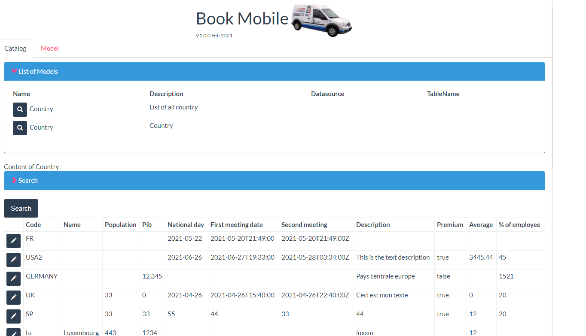

# page_bookmobile

Do you have some "reference" data in your BDM? Data like a list of countries,  a list of airports, or anything like this.

With Bonita, to populate this list, you have to build one process per data. So, you have to build the 2 or 3 processes (add, edit, delete), forms for each data. You had a new column in one data? You have to update the form, the contract, the script.
BookMobile saves your day! With that page, just reference the BDM you want to access, and you will get a search form, a list of all your records, and the Edit or Add button.

Or you have this kind of list but in an external database? On this page, reference any external database you like.

 